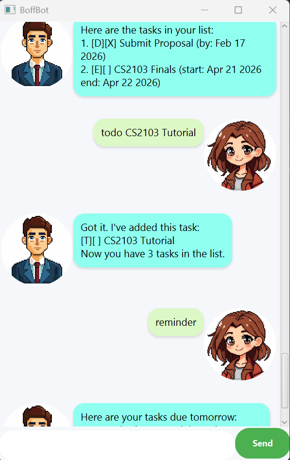

# BoffBot User Guide



BoffBot is a GUI-based task management chatbot that helps users manage and organize their tasks efficiently.  
It supports adding todos, deadlines, and events, as well as marking, deleting, searching, and reminder features.

All tasks are automatically saved and loaded from local storage.

---

# Features

---

## Adding a Todo

Adds a simple task without a date.

### Format

`todo <description>`

### Example

`todo read book`

### Expected output

```
Got it. I've added this task:
[T][ ] read book
Now you have 1 tasks in the list.
```

If the description is empty:

```
Invalid input!!! The description of a todo cannot be empty.
```

---

## Adding a Deadline

Adds a task with a due date.

### Format

`deadline <description> /by <yyyy-MM-dd>`

### Example

`deadline submit assignment /by 2024-12-01`

### Expected output

```
Got it. I've added this task:
[D][ ] submit assignment (by: Dec 01 2024)
Now you have 2 tasks in the list.
```

If the date format is invalid:

```
Date must be in format yyyy-mm-dd
```

---

## Adding an Event

Adds a task with a start and end date.

### Format

`event <description> /from <yyyy-MM-dd> /to <yyyy-MM-dd>`

### Example

`event project meeting /from 2024-11-10 /to 2024-11-12`

### Expected output

```
Got it. I've added this task:
[E][ ] project meeting (start: Nov 10 2024 end: Nov 12 2024)
Now you have 3 tasks in the list.
```

If the end date is before the start date:

```
End date cannot be before start date.
```

---

## Listing Tasks

Displays all current tasks.

### Format

`list`

If tasks exist:

```
Here are the tasks in your list:
1. [T][ ] read book
2. [D][ ] submit assignment (by: Dec 01 2024)
```

If no tasks exist:

```
No tasks currently. Add a new task!
```

---

## Marking a Task

Marks a task as completed.

### Format

`mark <task number>`

### Example

`mark 1`

### Expected output

```
Nice! I've marked this task as done:
[T][X] read book
```

If the task number is invalid:

```
Invalid!! Please enter a number between 1 and 3
```

---

## Unmarking a Task

Marks a task as not completed.

### Format

`unmark <task number>`

### Example

`unmark 1`

### Expected output

```
OK, I've marked this task as not done yet:
[T][ ] read book
```

---

## Deleting a Task

Removes a task from the list.

### Format

`delete <task number>`

### Example

`delete 2`

### Expected output

```
Noted. I've removed this task:
[D][ ] submit assignment (by: Dec 01 2024)
Now you have 2 tasks in the list.
```

---

## Finding Tasks

Searches for tasks containing a keyword.

### Format

`find <keyword>`

### Example

`find book`

### Expected output

```
Here are the matching tasks in your list:
[T][ ] read book
```

If no matches are found:

```
No matching tasks found.
```

---

## Reminding Upcoming Deadlines

Displays deadlines due tomorrow.

### Format

`remind`

If deadlines exist:

```
Here are your tasks due tomorrow:
[D][ ] submit report (by: Nov 20 2024)
```

If none exist:

```
No deadlines due tomorrow 🎉
```

---

## Exiting the Application

Closes the chatbot session.

### Format

`bye`

### Expected output

```
Bye. Hope to see you again soon!
```

---

# Data Storage

All tasks are automatically saved to:

```
data/boffbot.txt
```

When BoffBot starts, previously saved tasks are loaded automatically.

---

# Error Handling

BoffBot handles common user errors gracefully, including:

- Missing descriptions  
- Invalid task numbers  
- Incorrect date formats  
- Incorrect command syntax  
- Empty task list  
- Missing data file  

Clear error messages are displayed in the GUI to guide users.

---

## Command Summary

| Action | Format & Example |
|--------|-----------------|
| **Add Todo** | `todo <description>`  <br> e.g., `todo read book` |
| **Add Deadline** | `deadline <description> /by <yyyy-MM-dd>`  <br> e.g., `deadline submit report /by 2024-12-01` |
| **Add Event** | `event <description> /from <yyyy-MM-dd> /to <yyyy-MM-dd>`  <br> e.g., `event meeting /from 2024-11-10 /to 2024-11-12` |
| **List Tasks** | `list` |
| **Mark Task** | `mark <task number>`  <br> e.g., `mark 1` |
| **Unmark Task** | `unmark <task number>`  <br> e.g., `unmark 1` |
| **Delete Task** | `delete <task number>`  <br> e.g., `delete 2` |
| **Find Tasks** | `find <keyword>`  <br> e.g., `find book` |
| **Remind Deadlines** | `remind` |
| **Exit** | `bye` |

---
